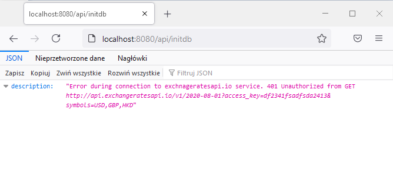

### Description
Microservice to retrieve exchange rates data from https://exchangeratesapi.io  service and store them in database.

### Configuration
Initially only three configuration variables should be set:

1. The list of imported currencies as comma delimited strings

`exchange-rates.import-currencies=EUR,GPB,HKD`

2. exchangeratesapi.io URI

`exchange-rates.exchangeratesapi-io-api-key=http://api.exchangeratesapi.io`

3. exchangeratesapi.io API_KEY

`exchange-rates.exchangeratesapi-io-uri=API_KEY(from your plan)`

### How to compile and run
Project is maven based so follow standard maven pipeline:

`mvn clean build` or `mvn clean install` or `mvn ...`

To run use:

`./mvnw spring-boot:run`

Service is available at `http://localhost:8080`

Project is configured against Java 11.

### API description

The API consists of two endpoints:

`/api/initdb`

Initialize database, connect to https://exchangeratesapi.io and download data for last 12 months (only one day form each month is downloaded and stored).

`/api/rates`
The data access endpoint

More info about API is available at `http://localhost:8080/swagger-ui.html`

### API description

When service is started the database is empty:

Hiting `/api/initdb` results in filling database:

Using API we could filter/extend data in several ways:

Errors (except HTTP 404) are reported in JSON format as well:

